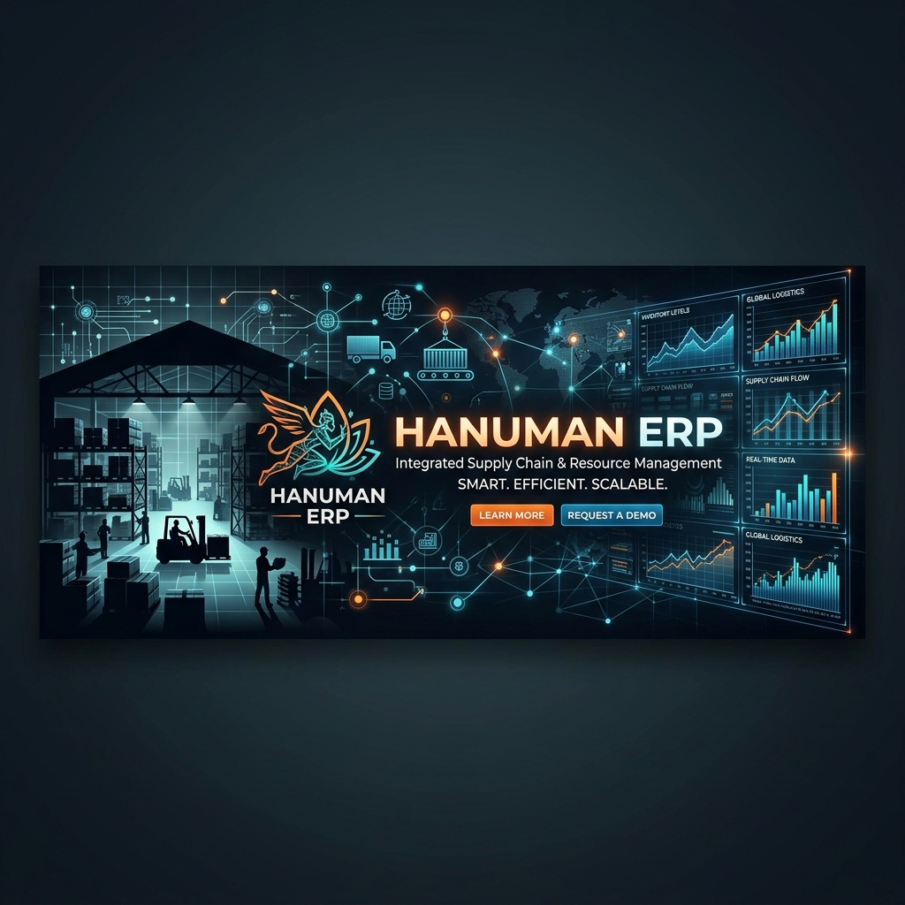
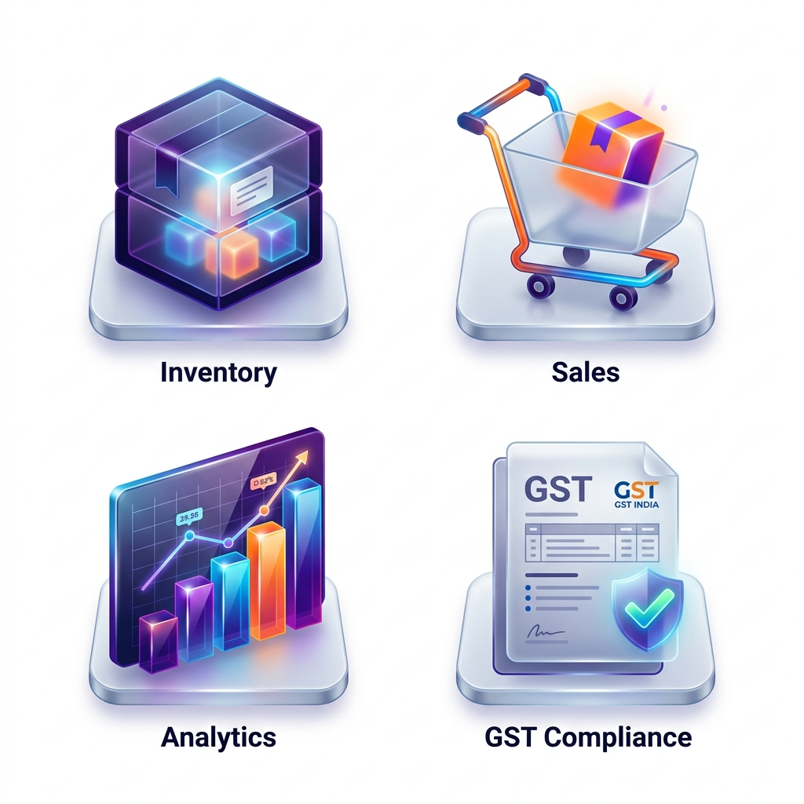

<p align="center">
  
</p>

<h1 align="center">🕉️ Hanuman ERP</h1>

<p align="center">
  <strong>The Ultimate Offline-First, GST-Compliant Supply Chain Solution for Indian Hardware Businesses.</strong>
</p>

<p align="center">
  
  
  
  
  
</p>

---

## ✨ Features at a Glance

<p align="center">
  
</p>

### 📦 Smart Inventory Management
- **HSN-wise Tracking**: Automatic grouping and tax calculation based on Indian GST laws.
- **Offline-First Architecture**: Work seamlessly without internet; your data stays in your browser.
- **Stock Alerts**: Get notified when items reach minimum levels.

### 🧾 Comprehensive Sales & Billing
- **GST-Compliant Invoices**: Generate professional PDFs with IGST/CGST/SGST splits.
- **Quotations to Sales Orders**: One-click conversion for a smooth sales workflow.
- **Payment Tracking**: Manage accounts receivable with ease.

### 🛡️ Security & Reliability
- **Local Persistence**: Uses IndexedDB for lightning-fast, secure local storage.
- **Auto-Backups**: Daily JSON exports to ensure your business data is never lost.
- **100% White-Labeled**: Fully customizable branding for your hardware shop.

---

## 🚀 Getting Started

### Prerequisites
- **Node.js**: v18 or higher
- **Browser**: Chrome, Edge, or Firefox (Latest versions)

### Installation
1. Clone the repository:
   ```bash
   git clone https://github.com/dheerajguptajapan-ui/hanumanERP.git
   ```
2. Navigate to the project directory:
   ```bash
   cd hardware-erp
   ```
3. Install dependencies:
   ```bash
   npm install
   ```
4. Start the development server:
   ```bash
   npm run dev
   ```

---

## 🛠️ Tech Stack

- **Frontend**: React.js with TypeScript
- **Styling**: Mantine UI & Tailwind CSS
- **Icons**: Lucide React
- **Database**: Dexie.js (IndexedDB Wrapper)
- **Deployment**: GitHub Pages (Automated via GitHub Actions)
- **PWA**: Vite PWA Plugin

---

## 📑 GST Compliance Manual

For a detailed guide on setting up your organization profile and maintaining tax compliance, please refer to our [Deployment Manual](docs/manual.md).

---

<p align="center">
  Built with ❤️ for Indian Small Businesses.
</p>
